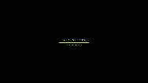

# C.R.I.S - Central de Reconhecimento de Irregularidades Sobrenaturais

> "O paranormal não vem para a nossa realidade de maneira fácil."

A **Central de Reconhecimento de Irregularidades Sobrenaturais**, ou mais conhecida como a abreviação **C.R.I.S**, é um programa criado por Kaiser para reconhecer irregularidades sobrenaturais no mundo.

O C.R.I.S age vasculhando a internet rastreando padrões repetitivos que indiquem presença Paranormal: postagens assustadoras em redes sociais, reportagens em jornais pequenos, desaparecimentos misteriosos. Essa é a principal ferramenta da **Ordo Realitas** para encontrar possíveis novos casos nos tempos modernos, além de organizar a documentação de antigos casos e informações dos agentes.

Este repositório contém o código fonte completo desta Inteligência Artificial, capaz de responder perguntas sobre o universo de Ordem Paranormal utilizando técnicas avançadas de RAG (Retrieval-Augmented Generation) com base na Wiki oficial.

---

## 🖥️ Demonstração do Sistema



### 🌐 Acesso Rápido (Live Version)
O sistema está operante e pode ser acessado diretamente pelo terminal seguro:
👉 **[Acessar C.R.I.S Terminal](https://ricsrdocasro.github.io/C.R.I.S/frontend/)**

---

## 📂 Estrutura do Projeto

O projeto é dividido em três módulos principais, cada um responsável por uma etapa do funcionamento da C.R.I.S:

### 1. `scraping_dataset/` (O Cérebro)
Aqui reside a lógica de aquisição de conhecimento. Scripts em Python vasculham a **Wiki da Ordem Paranormal**, extraem informações de páginas e "Cards" (fichas técnicas), e transformam esse texto em vetores numéricos (embeddings) armazenados em um banco de dados vetorial (ChromaDB).

*   **Principal Arquivo:** `scrape_wiki.py`
*   **Banco de Dados:** Devido ao tamanho dos arquivos, o banco de dados vetorial está hospedado no Hugging Face: [**C.R.I.S-Database**](https://huggingface.co/datasets/ricsrdocasro/C.R.I.S-Database).
*   **Saída Local:** Um banco de dados `chroma.sqlite3` contendo todo o conhecimento da Ordem.

### 2. `backend/` (O Núcleo de Processamento)
O backend é uma API construída com **FastAPI** e hospedada no **Hugging Face Spaces**. Ele atua como o intermediário entre o usuário e o conhecimento.
*   **Funcionalidade:**
    *   Recebe a pergunta do agente.
    *   Busca no banco de dados (RAG) os trechos mais relevantes da Wiki.
    *   Envia o contexto + pergunta para um LLM (DeepSeek-V3 via SiliconFlow).
    *   Retorna a resposta com a personalidade analítica da C.R.I.S.

### 3. `frontend/` (A Interface Terminal)
A interface visual com a qual os agentes interagem. Desenvolvida em **HTML/CSS/JS** puro para máxima performance e fidelidade estética, sendo perfeitamente compatível com o **GitHub Pages** para hospedagem estática.
*   **Design:** Estilo terminal hacker retrô, com efeitos de CRT, scanlines e glitch.
*   **Reatividade:** A cor do terminal muda conforme o Elemento Paranormal detectado no texto (Sangue, Morte, Conhecimento, Energia, Medo).
*   **Imersão:** Sons de inicialização, boot screen e comandos secretos (`/ritual`, `/membrana`, `/nex`).

---

## 🚀 Instalação e Uso

Siga os passos abaixo para executar cada parte do sistema localmente.

### Pré-requisitos
*   Python 3.10+
*   Git

### Passo 1: Configurar o Dataset (`scraping_dataset`)
Você pode recriar o banco de dados do zero ou baixar a versão já processada:

1.  **Opção A: Download do Banco (Recomendado):**
    Baixe os arquivos do banco de dados em [Hugging Face Datasets](https://huggingface.co/datasets/ricsrdocasro/C.R.I.S-Database) e coloque-os na pasta `scraping_dataset/cris_db_wiki`.
    
2.  **Opção B: Scraping Manual:**
    Navegue até a pasta:
    ```bash
    cd scraping_dataset
    ```
    Instale as dependências:
    ```bash
    pip install -r requirements.txt
    ```
    Execute o script de raspagem:
    ```bash
    python scrape_wiki.py
    ```
    *Isso criará a pasta `cris_db_wiki` com o banco vetorial.*

### Passo 2: Executar o Backend (`backend`)
Para rodar a API localmente:

1.  Navegue até a pasta:
    ```bash
    cd backend
    ```
2.  Instale as dependências:
    ```bash
    pip install -r requirements.txt
    ```
3.  Configure sua chave da API (SiliconFlow):
    *   Crie um arquivo `.env` ou exporte a variável:
    ```bash
    export SILICONFLOW_API_KEY="sua_chave_aqui"
    # Windows (PowerShell): $env:SILICONFLOW_API_KEY="sua_chave_aqui"
    ```
4.  Inicie o servidor:
    ```bash
    uvicorn app:app --reload
    ```
    *O servidor iniciará em `http://localhost:8000`.*

### Passo 3: Acessar o Frontend (`frontend`)
Você pode acessar a versão oficial hospedada no **GitHub Pages** através do link no topo deste README ou rodar localmente:

1.  Navegue até a pasta `frontend`.
2.  Abra o arquivo `index.html` no seu navegador.
3.  **Nota Importante:** Por padrão, o frontend está configurado para apontar para a API de produção no Hugging Face (permitindo que a versão do GitHub Pages funcione imediatamente). Para testar com seu backend local:
    *   Edite o `index.html`.
    *   Procure a linha: `const API_URL = "https://ricsrdocasro-c-r-i-s-backend.hf.space/chat";`
    *   Altere para: `const API_URL = "http://localhost:8000/chat";`

---

## 🕵️ Comandos do Terminal
Dentro da interface, tente os seguintes comandos:
*   `/membrana`: Verifica a estabilidade da realidade local.
*   `/nex`: Calcula seu Nível de Exposição Paranormal.
*   `/ritual`: 👁️ (Cuidado).
*   `/creditos`: Exibe informações do desenvolvedor.
*   `/clear`: Limpa o terminal.

---

## 📜 Créditos

*   **Desenvolvido por:** [ricsrdocasro](https://github.com/ricsrdocasro)
*   **Baseado em:** Ordem Paranormal RPG (Cellbit).
*   **Tecnologias:** Python, LangChain, ChromaDB, FastAPI, DeepSeek-V3.

> *Veritas Liberabit Vos.*